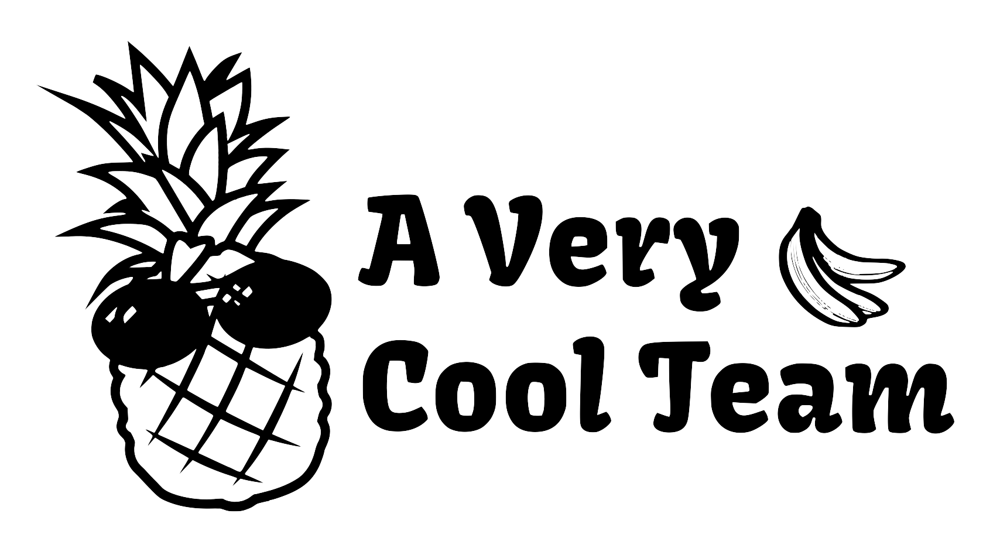
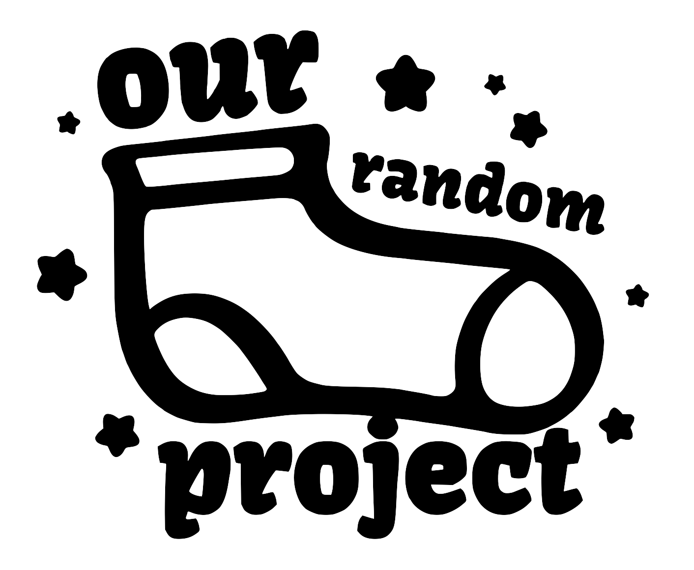

# PROJECT_NAME

<em style="float:right;"> by TEAM_NAME </em>

---
# We present to you...

---
# The issue...

---

# How our solution works

---
# Three simple steps...
<ol style='font-family:"Tahoma";margin-left:52px;width:85%;height:450px'>
<li style='font-size:36px;font-weight:700;margin-bottom:23px'>STEP_ONE</li>
</ol>

---
# Three simple steps...
<ol style='font-family:"Tahoma";margin-left:52px;width:85%;height:450px'>
<li style='font-size:36px;font-weight:700;margin-bottom:23px'>STEP_ONE</li>
<li style='font-size:36px;font-weight:700;margin-bottom:23px'>STEP_TWO</li>
</ol>

---
# Three simple steps...
<ol style='font-family:"Tahoma";margin-left:52px;width:85%;height:450px'>
<li style='font-size:36px;font-weight:700;margin-bottom:23px'>STEP_ONE</li>
<li style='font-size:36px;font-weight:700;margin-bottom:23px'>STEP_TWO</li>
<li style='font-size:36px;font-weight:700;margin-bottom:23px'>STEP_THREE</li>
</ol>

---
# Time for a demo!

<video width="100%" height="600" controls>
  <source src="assets/demo.mp4" type="video/mp4">
</video>

---

# Thank you!

_And a special thanks to ORGANIZERS for organising this wonderful hackathon._

