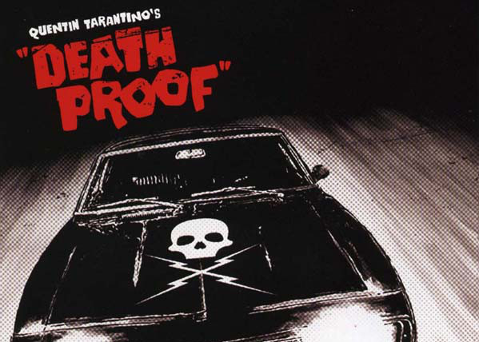

# Hackathon Video Generator

<em style="float:right;"> by Team Scripting Quarantino </em>

---
# We present to you...

---
# The issue...

---

# How our solution works

---

# Three simple steps...
### 1 - It reads in a config file that contains all information relevant to your project
### 
### 

---

# Three simple steps...
### 1 - It reads in a config file that contains all information relevant to your project
### 2 - It automatically generates the audio and the slides you need for your video
### 

---
# Three simple steps...
### 1 - It reads in a config file that contains all information relevant to your project
### 2 - It automatically generates the audio and the slides you need for your video
### 3 - Your beautiful video is ready to be shown to the world

---

# Time for a demo!

<video width="100%" height="600" controls>
  <source src="assets/demo.mp4" type="video/mp4">
</video>

---

# How it was set up

---

# Solution Architecture

---

# Thank you!

_And a special thanks to Hacklarious for organising this wonderful hackathon._

