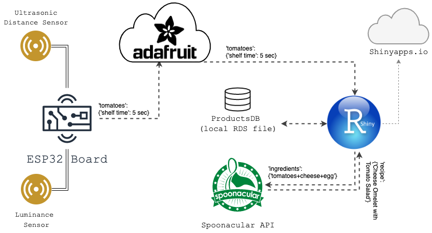

# Hackathon Video Generator

<em style="float:right;"> A project by team texasTopf </em>

---
# We present to you...

---
# The issue...

---

# How our solution works

---

# Three simple steps...
## 1
## 
## 

---

# Three simple steps...
## 1
## 2
## 

---
# Three simple steps...
## 1
## 2
## 3

---

# Time for a demo!

<video width="100%" height="600" controls>
  <source src="assets/demo.mp4" type="video/mp4">
</video>

---

# How it was set up

---

# Solution Architecture

---

# Thank you!

